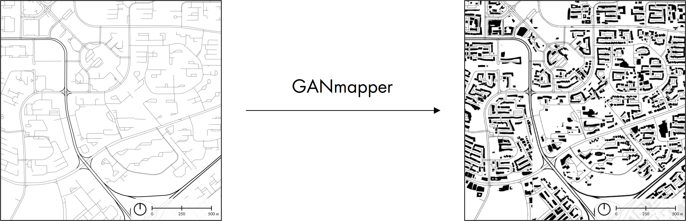

<p align="center">
  <a href="https://ual.sg/">
    
  </a>
  <h3 align="center">GANmapper - Geospatial Content Filling</h3>
  <a >
    
  </a>
</p>

This is the official repo of GANmapper, a building footprint generator using Generative Adversarial Networks

## Running GANmapper 
### 1. Install prerequisites

Use `environment.yml` to create a conda environment for GANmapper

  ```sh
  conda env create -f environment.yml
  conda activate GANmapper
  ```

### 2. Download weights
The weights files are available on figshare in the Checkpoints folder.

```https://doi.org/10.6084/m9.figshare.15103128.v1```

Place the `Checkpoints` folder in the repo.
### 3. Prediction
Predictions can be carried out by running the following sample code. The name of the city depends on the name of each dataset.
 ```sh
 python predict.py --dataroot <path to XYZ tile dir> --checkpoints_dir <path to checkpoint> --name <cityname> 
  ```

Testing an area in LA:
 ```sh
 python predict.py --dataroot datasets/Exp4/LA/Source --checkpoints_dir checkpoints/Exp3 --name LA 
  ```

Testing an area in Singapore:
 ```sh
 python predict.py --dataroot datasets/Exp4/Singapore/Source --checkpoints_dir checkpoints/Exp3 --name Singapore 
  ```

The result will be produced in XYZ directories in `./results/<cityname>/test_latest/images/fake`

You can choose to visualise the tiles in QGIS using a local WMTS server.

For example, use the following url and choose Zomm 16 only.

```
file:///D:/GANmapper//results/Singapore/test_latest/images/fake/{z}/{x}/{y}.png
```

### 4. Vectorization

If you want the output to be in Geojson polygons, use `extract.py`

```sh
  python extract.py <tile_dir>  <out> 
```

```sh
  python extract.py results/Exp4/LA/test_latest/images/fake LA.geojson
```

<!-- 
### Data Preparation
XYZ tiles can be prepared using QGIS. A script is prepared to 
### Training

python train.py --dataroot /dataset/Exp1/Color --name <Exp name> --model pix2pix --netG resnet_9blocks


 ```sh
  python train.py --dataroot  --name <exp name> --model pix2pix --netG resnet_9blocks
  ```
LICENSE -->

## License

Distributed under the MIT License. See `LICENSE` for more information.

<!-- CONTACT -->

<!-- ## Contact

Your Name - [@your_twitter](https://twitter.com/your_username) - email@example.com

Project Link: [https://github.com/your_username/repo_name](https://github.com/your_username/repo_name) -->

## Citation

A [paper](https://doi.org/10.1080/13658816.2022.2041643) about the work was published in _International Journal of Geographical Information Science_, and it is available open access [here](https://ual.sg/publication/2022-ijgis-ganmapper/2022-ijgis-ganmapper.pdf).

If you like this work and would like to use it in a scientific context, please cite this article.

Wu AN, Biljecki F (2022): GANmapper: geographical data translation. International Journal of Geographical Information Science, 36(7): 1394-1422. doi:10.1080/13658816.2022.2041643

```
@article{2022_ijgis_ganmapper,
 author = {Wu, Abraham Noah and Biljecki, Filip},
 doi = {10.1080/13658816.2022.2041643},
 journal = {International Journal of Geographical Information Science},
 title = {{GANmapper: geographical data translation}},
 volume = {36},
 issue = {7},
 pages = {1394-1422},
 year = {2022}
}
```

## Contact

[Abraham Noah Wu](https://ual.sg/authors/abraham/), [Urban Analytics Lab](https://ual.sg), National University of Singapore, Singapore

<!-- ACKNOWLEDGEMENTS -->
## Acknowledgements

This research is part of the project Large-scale 3D Geospatial Data for Urban Analytics, which is supported by the National University of Singapore under the Start-Up Grant R-295-000-171-133.

We gratefully acknowledge the sources of the used input data.

GANmapper is made possible by using the following packages

* [PyTorch](https://pytorch.org/)
* [GeoPandas](https://geopandas.org/)
* [Robosat](https://github.com/mapbox/robosat) - 
 mask to feature function is borrowed from robosat
* [pix2pix](https://github.com/junyanz/pytorch-CycleGAN-and-pix2pix) - 
Model Architecture is heavily borrowed from the awesome repo by [junyanz](https://github.com/junyanz)
